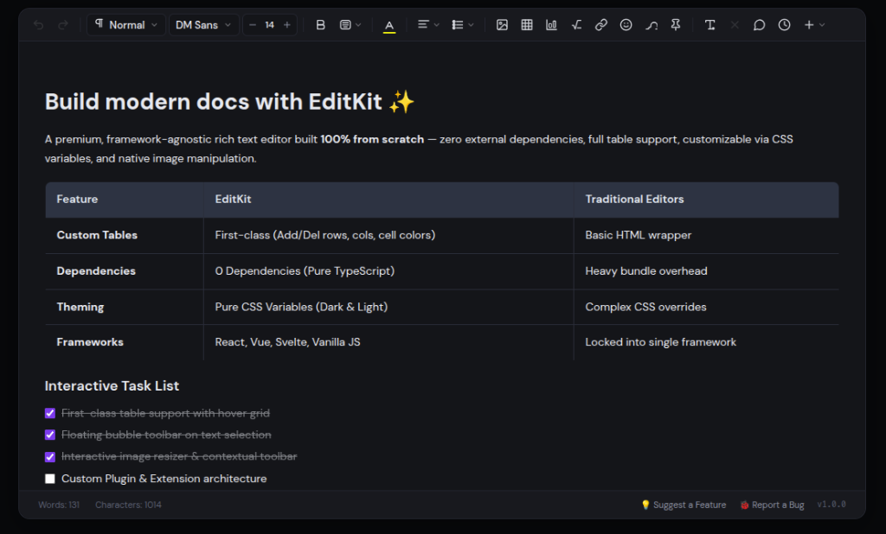

# EditKit ✨

<p align="center">
  <strong>A Premium, Framework-Agnostic, Zero-Dependency Rich Text Editor SDK for Modern Web Apps</strong>
</p>

<p align="center">
  
  
  
  
  
</p>

<p align="center">
  
</p>

---

## 🚀 Overview

**EditKit** is a state-of-the-art, extensible rich text editor built **100% from scratch** in pure TypeScript with **zero external dependencies** (no ProseMirror, Lexical, Slate, or Quill required).

Crafted with high-end modern aesthetics, it delivers:
- ⚡ **Blazing Fast Performance**: Zero-bundle overhead, lightweight and instant startup.
- 🎨 **Sleek Modern UI**: Premium dark & light theme built with pure CSS variables.
- 📊 **First-Class Interactive Tables**: 6×6 visual hover grid, dynamic rows/cols manipulation, and cell coloring.
- 🌈 **2D HSV Custom Color Picker**: Full palette swatches + 2D saturation/brightness spectrum and hue slider.
- 🫧 **Contextual Floating Menus**: Smart text selection bubble toolbar, floating table controls, and image resizer.
- 🔌 **Modular Architecture**: Dedicated official packages for **React**, **Vue 3**, **Svelte**, and **Vanilla JS**.

---

## 📦 Compatibility & Supported Versions

| Framework / Environment | Minimum Version | Supported Range | Package to Install |
| :--- | :--- | :--- | :--- |
| **Node.js** | `>= 18.0.0` | `18.x`, `20.x`, `22.x+` | - |
| **React** | **16.8+** | `^16.8.0 \|\| ^17.0.0 \|\| ^18.0.0 \|\| ^19.0.0` | `@editkit/react` + `@editkit/ui` |
| **Vue** | **3.0+** | `>= 3.0.0` (Vue 3.0 through Vue 3.5+) | `@editkit/vue` + `@editkit/ui` |
| **Svelte** | **3.0+** | `^3.0.0 \|\| ^4.0.0 \|\| ^5.0.0` (Runes) | `@editkit/svelte` + `@editkit/ui` |
| **Vanilla JS / TS** | **Any** | All modern browsers (Chrome, Safari, Firefox, Edge) | `@editkit/core` + `@editkit/ui` |

---

## 📥 Installation & Setup by Framework

### 1. ⚛️ React / Next.js / Laravel Inertia React

```bash
# npm
npm install @editkit/react @editkit/ui

# pnpm
pnpm add @editkit/react @editkit/ui

# yarn
yarn add @editkit/react @editkit/ui
```

#### Component Usage (`<EditKitEditor />`):

```tsx
import React, { useState } from 'react';
import { EditKitEditor } from '@editkit/react';
import '@editkit/ui/styles';

export default function App() {
  const [content, setContent] = useState('<h1>Hello EditKit</h1><p>Start writing...</p>');

  return (
    <div className="max-w-4xl mx-auto p-4">
      <EditKitEditor
        value={content}
        onChange={setContent}
        theme="dark" // 'dark' | 'light' | 'system'
        placeholder="Type something amazing..."
        // Granularly toggle any feature on/off:
        features={{
          math: false,           // Hide LaTeX Math formula modal
          chart: false,          // Hide Chart widget
          comment: false,        // Hide Comment button
          versionHistory: false, // Hide Snapshot button
          bookmark: false,       // Hide Bookmark / Pin
        }}
        bubbleMenu={true}        // Floating selection bubble menu
        tableMenu={true}         // Contextual floating table actions
        imageMenu={true}         // Floating image resize bar
      />
    </div>
  );
}
```

#### Hook Usage (`useEditKitEditor`):

```tsx
import React from 'react';
import { useEditKitEditor } from '@editkit/react';
import '@editkit/ui/styles';

export function CustomEditor() {
  const { editor, containerRef } = useEditKitEditor({
    content: '<p>Custom headless integration</p>',
    theme: 'dark',
    features: {
      chart: false,
    },
  });

  return (
    <div>
      <div className="custom-actions">
        <button onClick={() => editor?.commands.bold()}>Bold</button>
        <button onClick={() => editor?.commands.italic()}>Italic</button>
      </div>
      <div ref={containerRef} />
    </div>
  );
}
```

---

### 2. 🟢 Vue 3 / Nuxt 3 / Laravel Inertia Vue

```bash
# npm
npm install @editkit/vue @editkit/ui

# pnpm
pnpm add @editkit/vue @editkit/ui
```

#### Component Usage (`<EditKitEditor />` with `v-model`):

```vue
<script setup lang="ts">
import { ref } from 'vue';
import { EditKitEditor } from '@editkit/vue';
import '@editkit/ui/styles';

const content = ref('<p>Hello from Vue 3 and EditKit!</p>');
</script>

<template>
  <div class="editor-wrapper">
    <EditKitEditor
      v-model="content"
      theme="dark"
      placeholder="Start typing in Vue..."
      :features="{
        math: false,
        chart: false,
        table: true,
        emoji: true,
      }"
      :bubble-menu="true"
      :table-menu="true"
      :image-menu="true"
    />
  </div>
</template>
```

#### Composable Usage (`useEditKitEditor`):

```vue
<script setup lang="ts">
import { useTemplateRef } from 'vue';
import { useEditKitEditor } from '@editkit/vue';
import '@editkit/ui/styles';

const editorEl = useTemplateRef<HTMLElement>('editorEl');
const { editor } = useEditKitEditor(editorEl, {
  content: '<p>Composable based editor</p>',
  theme: 'dark',
});
</script>

<template>
  <div>
    <button @click="editor?.commands.bold()">Bold</button>
    <div ref="editorEl" />
  </div>
</template>
```

---

### 3. 🟠 Svelte / SvelteKit (Svelte 3, 4, 5)

```bash
# npm
npm install @editkit/svelte @editkit/ui

# pnpm
pnpm add @editkit/svelte @editkit/ui
```

#### Svelte Action Usage (`use:editkit`):

```svelte
<script lang="ts">
  import { editkit } from '@editkit/svelte';
  import '@editkit/ui/styles';

  let content = '<p>Hello from Svelte!</p>';
</script>

<div
  use:editkit={{
    content,
    theme: 'dark',
    placeholder: 'Write with EditKit in Svelte...',
    features: {
      chart: false,
      math: false,
    },
    onChange: (html) => {
      content = html;
    }
  }}
/>
```

---

### 4. 🍦 Vanilla JavaScript / TypeScript

```bash
npm install @editkit/core @editkit/ui
```

```ts
import { EditKitEditor } from '@editkit/core';
import { createToolbar, BubbleMenu, TableFloatingMenu, ImageFloatingMenu } from '@editkit/ui';
import '@editkit/ui/styles';

// 1. Initialize core editor
const editor = new EditKitEditor({
  theme: 'dark', // 'dark' | 'light' | 'system'
  defaultFontFamily: 'DM Sans',
  defaultFontSize: 14,
  placeholder: 'Start writing...',
  content: '<p>Welcome to EditKit!</p>',
  onUpdate: (ed) => {
    console.log('HTML:', ed.getHTML());
  },
});

// 2. Attach Toolbar (with custom feature toggles)
const toolbar = createToolbar(editor, {
  features: {
    chart: false,
    math: false,
  },
});
editor.root.insertBefore(toolbar.element, editor.contentEl);

// 3. Attach Floating Menus
new BubbleMenu(editor).mount(editor.root);
new TableFloatingMenu(editor).mount(editor.root);
new ImageFloatingMenu(editor).mount(editor.root);

// 4. Mount into container element
editor.mount(document.getElementById('editor')!);
```

---

## 🎛️ Feature & Toolbar Configuration Props

When configuring the toolbar via `features` (in React/Vue/Svelte or Vanilla), you can toggle any button or tool individually:

| Feature Key | Type | Default | Description |
| :--- | :--- | :--- | :--- |
| `history` | `boolean` | `true` | Undo & Redo button group |
| `block` | `boolean` | `true` | Paragraph & Headings dropdown (Heading 1 to 6) |
| `fontFamily` | `boolean` | `true` | Font family picker (DM Sans, Inter, Geist, etc.) |
| `fontSize` | `boolean` | `true` | Font size stepper (`- 14 +`) |
| `bold` | `boolean` | `true` | Bold formatting button (`B`) |
| `format` | `boolean` | `true` | Extra formats (Italic, Underline, Strikethrough, Code, Sub/Superscript) |
| `color` | `boolean` | `true` | Text color & background highlight color popover (`A ˅`) |
| `align` | `boolean` | `true` | Alignment dropdown (Left, Center, Right, Justify) |
| `lists` | `boolean` | `true` | Bullet, Numbered, Task lists, Indent/Outdent & Line Height |
| `image` | `boolean` | `true` | Image dropzone upload & URL modal |
| `table` | `boolean` | `true` | Interactive 6x6 visual hover grid table inserter |
| `chart` | `boolean` | `true` | Insert Chart widget |
| `math` | `boolean` | `true` | LaTeX Math & Equation editor modal |
| `link` | `boolean` | `true` | In-place floating link preview & editor popover |
| `emoji` | `boolean` | `true` | Searchable emoji picker with category tabs |
| `symbol` | `boolean` | `true` | Special characters & math symbols picker |
| `bookmark` | `boolean` | `true` | Pin / Bookmark action |
| `selectAll` | `boolean` | `true` | Select all editor content (`⌘A`) |
| `clearAll` | `boolean` | `true` | Clear all content button (Cross icon, enabled only when all selected) |
| `comment` | `boolean` | `true` | Add comment button |
| `versionHistory` | `boolean` | `true` | Version snapshot history button |
| `more` | `boolean` | `true` | More tools dropdown (`+ ˅`) |

---

## 🎨 CSS Variable Theming

EditKit is styled using standard, cleanly scoped CSS variables. You can easily override colors, radii, and surfaces in plain CSS:

```css
[data-editkit],
[data-editkit-theme="dark"] {
  --editkit-bg: #0c0d10;
  --editkit-card-bg: #141519;
  --editkit-toolbar-bg: #18191e;
  --editkit-border: #23252f;
  --editkit-border-focus: #7c3aed;
  --editkit-primary: #7c3aed;
  --editkit-font: 'DM Sans', sans-serif;
}
```

---

## 💻 Local Playground & Development

To run the interactive live playground locally:

```bash
# 1. Install dependencies
pnpm install

# 2. Start Playground dev server
pnpm playground

# Runs at http://localhost:5173
```

---

## 📄 License

MIT © [Ashikur](https://github.com/ashikurweb)
